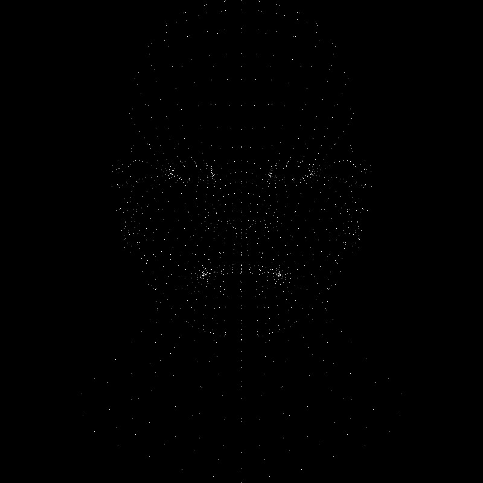
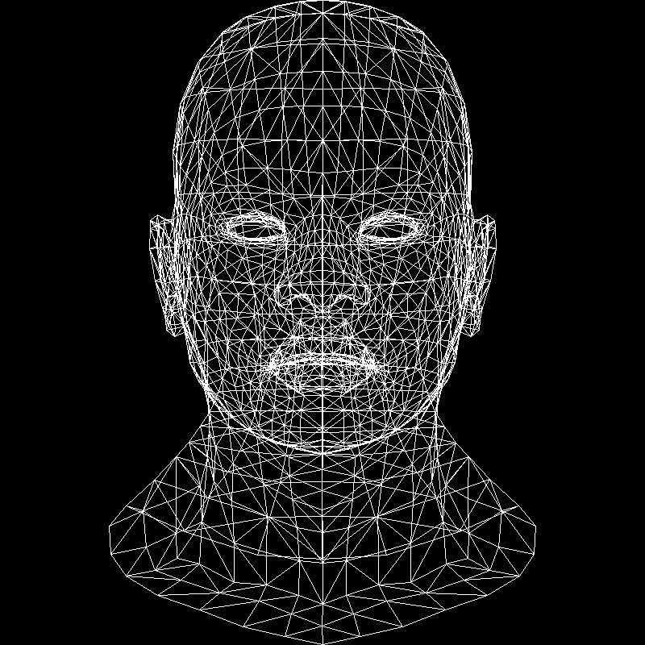

# Moteur 3D

Mon implémentation du moteur de rendu 3D : https://github.com/ssloy/tinyrenderer

## Lesson 1 Bresenham’s Line Drawing Algorithm :

- Affichage des sommets qui composent le modèle : [code](https://github.com/theoroton/Moteur_3D/tree/a13d11dfe5d40e0547a01eb80f37cc059624d32e)

- Affichage des triangles qui composent le modèle : [code](https://github.com/theoroton/Moteur_3D/tree/8a531e86cccd345dc557f55c7f8d7ab09b562318)

