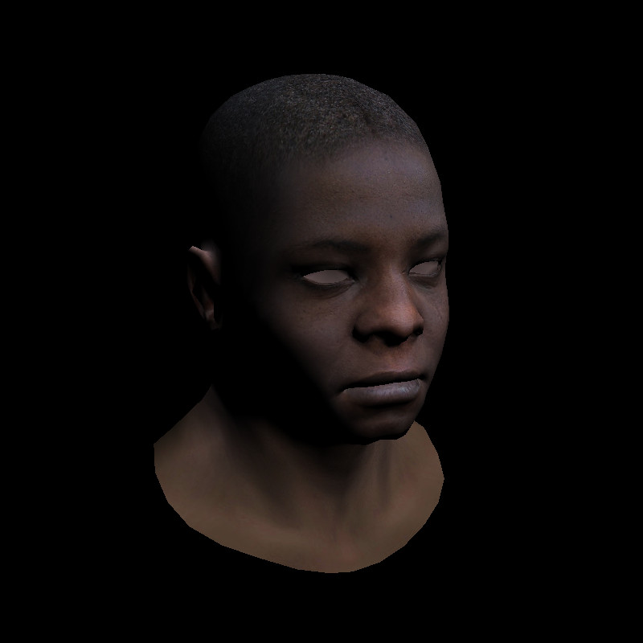

# Moteur 3D

Mon implémentation du moteur de rendu 3D : https://github.com/ssloy/tinyrenderer
Réalisé sur Visual Studio 2019
## Sommaire

- [Lesson 1 Bresenham’s Line Drawing Algorithm](#lesson-1-bresenhams-line-drawing-algorithm)
- [Lesson 2 Triangle rasterization and back face culling](#lesson-2-triangle-rasterization-and-back-face-culling)
- [Lesson 3 Hidden faces removal (z buffer)](#lesson-3-hidden-faces-removal-z-buffer)
- [Lesson 4 Perspective projection](#lesson-4-perspective-projection)
- [Lesson 5 Moving the camera](#lesson-5-moving-the-camera)
- [Lesson 6 Shaders for the software renderer](#lesson-6-shaders-for-the-software-renderer)

## Lesson 1 Bresenham’s Line Drawing Algorithm

- Affichage des sommets qui composent le modèle : [code](https://github.com/theoroton/Moteur_3D/tree/a13d11dfe5d40e0547a01eb80f37cc059624d32e)

- Affichage des triangles qui composent le modèle : [code](https://github.com/theoroton/Moteur_3D/tree/8a531e86cccd345dc557f55c7f8d7ab09b562318)

## Lesson 2 Triangle rasterization and back face culling

- Remplissage des triangles simple (triangle coupé en 2 parties) : [code](https://github.com/theoroton/Moteur_3D/tree/3407e9ad9b1b9904dd252af66c51391d1ffc35c9)

- Remplissage des triangles avec coordonnées barycentriques (couleurs aléatoires) : [code](https://github.com/theoroton/Moteur_3D/tree/9c19667965ef45ac4df9b4200491011d8f5ca85d)

- Ajout de la lumière sur le modèle : [code](https://github.com/theoroton/Moteur_3D/tree/ff83f128228e698509f99d57f049358bf93aa064)

## Lesson 3 Hidden faces removal (z buffer)

- Z buffer : [code](https://github.com/theoroton/Moteur_3D/tree/2d219f0ff74c3f18eb698ab0d9f2420fb47cc677)

- Affichage des textures : [code](https://github.com/theoroton/Moteur_3D/tree/394c523e92cc7ed7e8098dbdfcfb0b0392bfee90)

## Lesson 4 Perspective projection

- Projection : [code](https://github.com/theoroton/Moteur_3D/tree/165a4b334f6f2b1e587c3c6502ce2fd8b55ee630) 

   
  
 

 
 ## Lesson 5 Moving the camera
 
 - Mouvement de caméra : [code](https://github.com/theoroton/Moteur_3D/tree/901f63e1511faf5b44e710323ec45e495e10d663)
 

   
  
  
 

 
 ## Lesson 6 Shaders for the software renderer

- Shaders
  - Shader simple en blanc : [code](https://github.com/theoroton/Moteur_3D/tree/7d90632551cf2ca4b6cfb9cbb11f1985b00eae14)
  

     
    
  

  
  - Shader avec niveaux d'intensités : [code](https://github.com/theoroton/Moteur_3D/tree/3faed7c1b5098359916eeb2e2980ad7253c41a51)
  

     
    
  

  
  - Shader avec texture : [code](https://github.com/theoroton/Moteur_3D/tree/3c247e9ec23101a70e1e4a6d9ba10c105506d2a1)
  

     
    
  

  
- Normal mapping : [code](https://github.com/theoroton/Moteur_3D/tree/c2e9c89eab3879acb6c707efa1f6b142d185e368)

